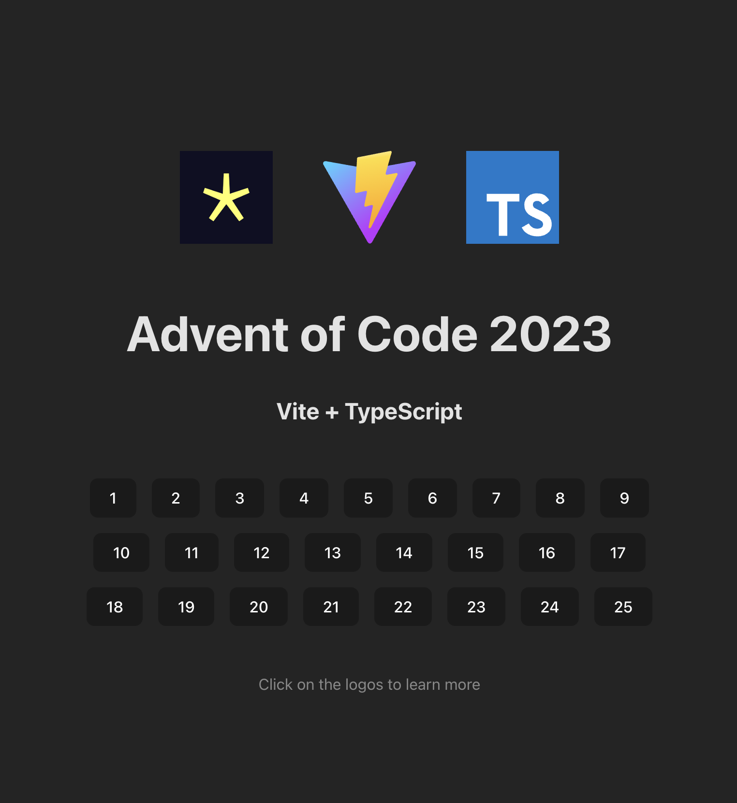

# Advent of Code 2023

My code for the 2023 advent of code challenge.

The Advent of Code is a competitive coding event that takes place every December. We have used modern technologies and best practices to ensure the highest quality of code.

## Setup

Follow the steps below to setup the project on your local machine:

1. **Pre-requisites:**
   - Ensure you have [Node.js](https://nodejs.org/en/) (version 18 or later) installed on your machine.
   - Ensure you have a package manager, preferably [Yarn](https://classic.yarnpkg.com/en/docs/install/#mac-stable) or [npm](https://www.npmjs.com/get-npm) installed.

2. **Clone The Repository:**
   - Run the command `git clone git@github.com:michael-letcher/advent-of-code-2023.git`.

3. **Install Dependencies:**
   - Navigate into the cloned repository.
   - Run `yarn install` or `npm install` to install the project dependencies.

## Running The Application

To start the application, follow the steps below:

1. Run `yarn dev` or `npm run dev` to start the application in development mode. The application will run at `http://localhost:5000`.
